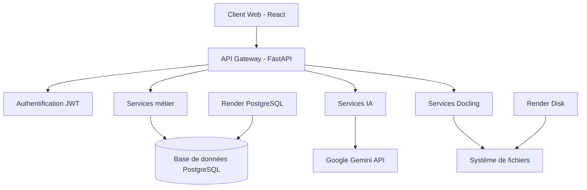
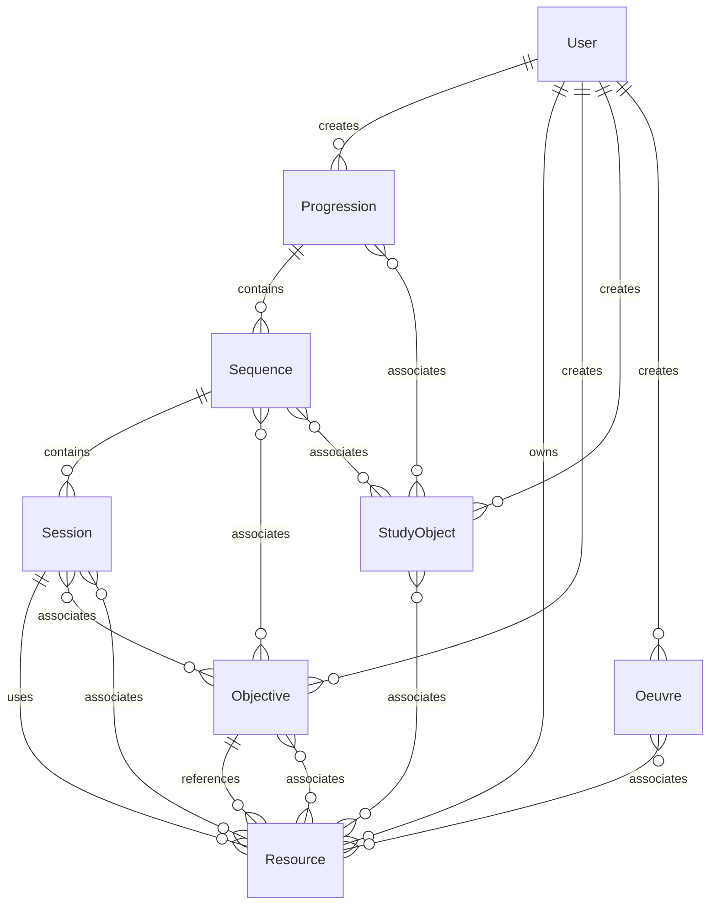

# Architecture système — Vue d'ensemble

## Vue d'ensemble

Flash Français Reborn est une application web moderne construite selon une architecture microservices-like avec séparation claire des responsabilités. Le système combine une API REST robuste avec une interface utilisateur réactive, intégrant des capacités d'intelligence artificielle pour la génération de contenu pédagogique.

## Architecture générale



## Composants principaux

### Backend - FastAPI

#### Structure des dossiers
```
backend/
├── app.py                      # Application principale FastAPI
├── config.py                   # Configuration centralisée
├── database.py                 # Configuration SQLAlchemy
├── dependencies.py             # Dépendances FastAPI (auth, DB)
├── models/                     # Modèles de données SQLAlchemy
│   ├── __init__.py
│   ├── user.py                 # Utilisateurs et rôles
│   ├── progression.py          # Progressions pédagogiques
│   ├── sequence.py             # Séquences d'enseignement
│   ├── session.py              # Séances de cours
│   ├── resource.py             # Ressources pédagogiques
│   ├── objective.py            # Objectifs d'apprentissage
│   ├── study_object.py         # Objets d'étude
│   ├── oeuvre.py               # Œuvres littéraires
│   └── association_tables.py   # Tables de liaison many-to-many
├── routers/                    # Endpoints API organisés par domaine
│   ├── auth.py                 # Authentification
│   ├── user.py                 # Gestion utilisateurs
│   ├── progression.py          # CRUD progressions
│   ├── sequence.py             # CRUD séquences
│   ├── session.py              # CRUD séances
│   ├── resource.py             # CRUD ressources
│   ├── objective.py            # CRUD objectifs
│   ├── study_object.py         # CRUD objets d'étude
│   ├── oeuvre.py               # CRUD œuvres
│   ├── ai_router.py            # Services IA
│   ├── docling.py              # Extraction PDF
│   ├── dashboard.py            # Tableau de bord
│   └── config.py               # Configuration système
├── schemas/                    # Schémas Pydantic pour validation
├── crud/                       # Opérations de base de données
├── ai/                         # Services d'intelligence artificielle
│   ├── ai_resource_service.py  # Service principal IA
│   ├── generation_service.py   # Génération de contenu
│   ├── prompts/                # Configuration des prompts
│   ├── services/               # Services spécialisés IA
│   └── templates/              # Templates HTML/Jinja
├── static/                     # Fichiers statiques générés
├── tests/                      # Tests unitaires et d'intégration
└── alembic/                    # Migrations de base de données
```

#### Points clés de l'architecture backend

1. **FastAPI Application** (`app.py`)
   - Configuration centralisée des routes
   - Middleware CORS et sécurité
   - Gestion des erreurs globale
   - Documentation OpenAPI automatique
   - Support des websockets (chat)

2. **Modèles de données** (`models/`)
   - SQLAlchemy ORM avec relations complexes
   - Tables d'association pour relations many-to-many
   - Audit automatique (created_at, updated_at)
   - Contraintes d'intégrité référentielle

3. **API REST** (`routers/`)
   - Organisation par domaine fonctionnel
   - Validation Pydantic des entrées/sorties
   - Gestion d'erreurs standardisée
   - Pagination et filtrage avancés

4. **Services IA** (`ai/`)
   - Intégration Google Gemini API
   - Génération de contenu éducatif
   - Fusion de templates avec données JSON
   - Cache et optimisation des performances

### Frontend - React

#### Structure des dossiers
```
frontend/
├── src/
│   ├── App.js                  # Application principale
│   ├── index.js                # Point d'entrée
│   ├── theme.js                # Configuration Material-UI
│   ├── components/             # Composants réutilisables
│   │   ├── SideNav/            # Navigation latérale
│   │   ├── Chatbox/            # Chat en temps réel
│   │   ├── ResourceGenerationWizard/  # Assistant IA
│   │   ├── DynamicAIForm/     # Formulaires dynamiques
│   │   ├── editors/           # Éditeurs de contenu
│   │   └── ...                # Autres composants
│   ├── pages/                  # Pages de l'application
│   │   ├── auth/              # Authentification
│   │   ├── dashboard/         # Tableau de bord
│   │   ├── resources/         # Gestion ressources
│   │   ├── progressions/      # Progressions
│   │   ├── sequences/         # Séquences
│   │   ├── sessions/          # Séances
│   │   ├── objectives/        # Objectifs
│   │   ├── studyObjects/      # Objets d'étude
│   │   └── oeuvres/           # Œuvres
│   ├── contexts/              # Contextes React
│   │   ├── AuthContext.js     # Authentification
│   │   └── TreeDataContext.js # Données arborescentes
│   ├── services/              # Services API
│   │   ├── api.js             # Client HTTP axios
│   │   ├── authService.js     # Authentification
│   │   └── resourceService.js # Ressources
│   └── utils/                 # Utilitaires
├── public/                    # Fichiers statiques
└── package.json               # Dépendances
```

#### Points clés de l'architecture frontend

1. **Application React** (`App.js`)
   - Architecture basée sur les routes
   - Layout protégé avec authentification
   - Navigation arborescente (TreeView)
   - Chat intégré (Drawer)

2. **Gestion d'état**
   - Context API pour l'authentification
   - Context pour les données arborescentes
   - État local des composants

3. **Composants principaux**
   - **ResourceGenerationWizard**: Assistant IA en 4 étapes
   - **DynamicAIForm**: Formulaires générés dynamiquement
   - **SideNav**: Navigation avec TreeView
   - **Chatbox**: Communication en temps réel

4. **Services**
   - Client HTTP axios avec intercepteurs
   - Gestion automatique des tokens JWT
   - Gestion d'erreurs centralisée

## Base de données

### Modèle relationnel



### Schéma principal

- **Users**: Gestion des utilisateurs avec rôles (teacher, student, admin)
- **Progressions**: Parcours pédagogiques globaux
- **Sequences**: Séquences d'enseignement dans une progression
- **Sessions**: Séances de cours dans une séquence
- **Objectives**: Objectifs d'apprentissage
- **Resources**: Ressources pédagogiques (PDF, texte, IA généré)
- **StudyObjects**: Objets d'étude (textes, œuvres)
- **Oeuvres**: Œuvres littéraires avec métadonnées

## Services externes

### Google Gemini API
- Génération de contenu éducatif
- Modèles de langage pour l'assistance pédagogique
- Templates et prompts spécialisés français

### Render Platform
- Hébergement backend et frontend
- Base de données PostgreSQL managée
- Stockage persistant (Render Disk)
- Variables d'environnement sécurisées

## Sécurité

### Authentification et autorisation
- JWT (JSON Web Tokens) pour l'authentification
- Rôles utilisateur (teacher, student, admin)
- Protection des routes sensibles
- Expiration et renouvellement des tokens

### Sécurité des données
- Validation Pydantic des entrées
- Sanitisation des données utilisateur
- Gestion sécurisée des fichiers uploadés
- Logs d'audit pour les opérations sensibles

## Déploiement

### Environnement de développement
- Docker pour la base de données locale
- Variables d'environnement `.env`
- Hot reload pour le développement
- Tests automatisés

### Environnement de production
- Render pour l'hébergement
- PostgreSQL managé
- Stockage persistant
- CI/CD avec Git
- Monitoring et logs

## Performance et scalabilité

### Optimisations backend
- Cache Redis (désactivé temporairement)
- Pagination des résultats
- Indexation de base de données
- Traitement asynchrone des tâches lourdes

### Optimisations frontend
- Code splitting
- Lazy loading des composants
- Optimisation des images
- Cache des requêtes API

## Monitoring et observabilité

### Logs
- Logs structurés avec niveaux
- Logs d'erreurs détaillés
- Traçabilité des opérations IA
- Monitoring des performances

### Métriques
- Temps de réponse API
- Utilisation des ressources
- Erreurs et exceptions
- Métriques d'utilisation

## Évolution et maintenance

### Structure modulaire
- Séparation claire des responsabilités
- Interfaces bien définies
- Tests automatisés
- Documentation technique complète

### Bonnes pratiques
- Code reviews systématiques
- Migrations de base de données versionnées
- Gestion des dépendances
- Documentation des changements

---

*Architecture conçue pour l'évolutivité et la maintenabilité*
