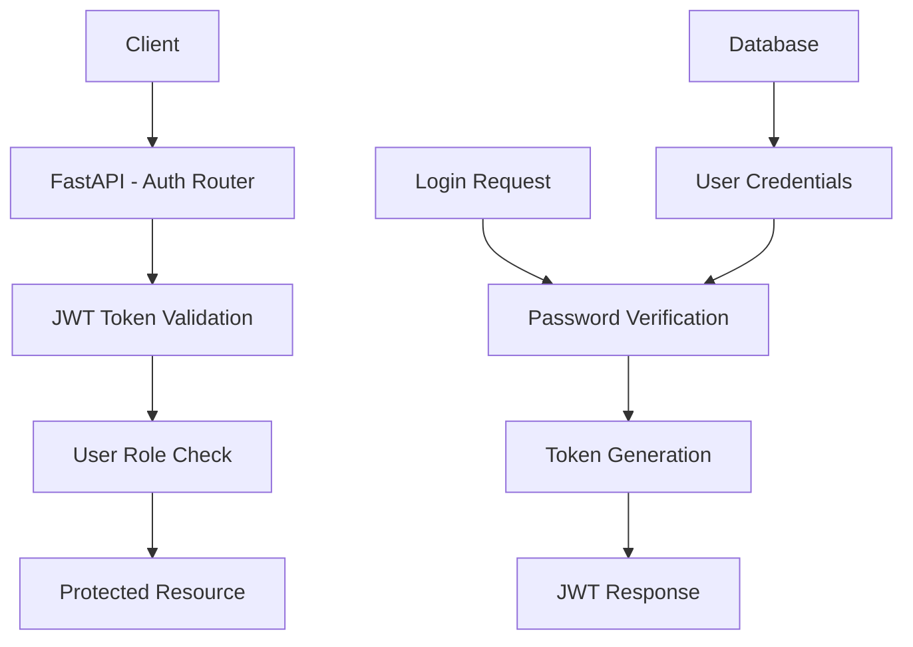
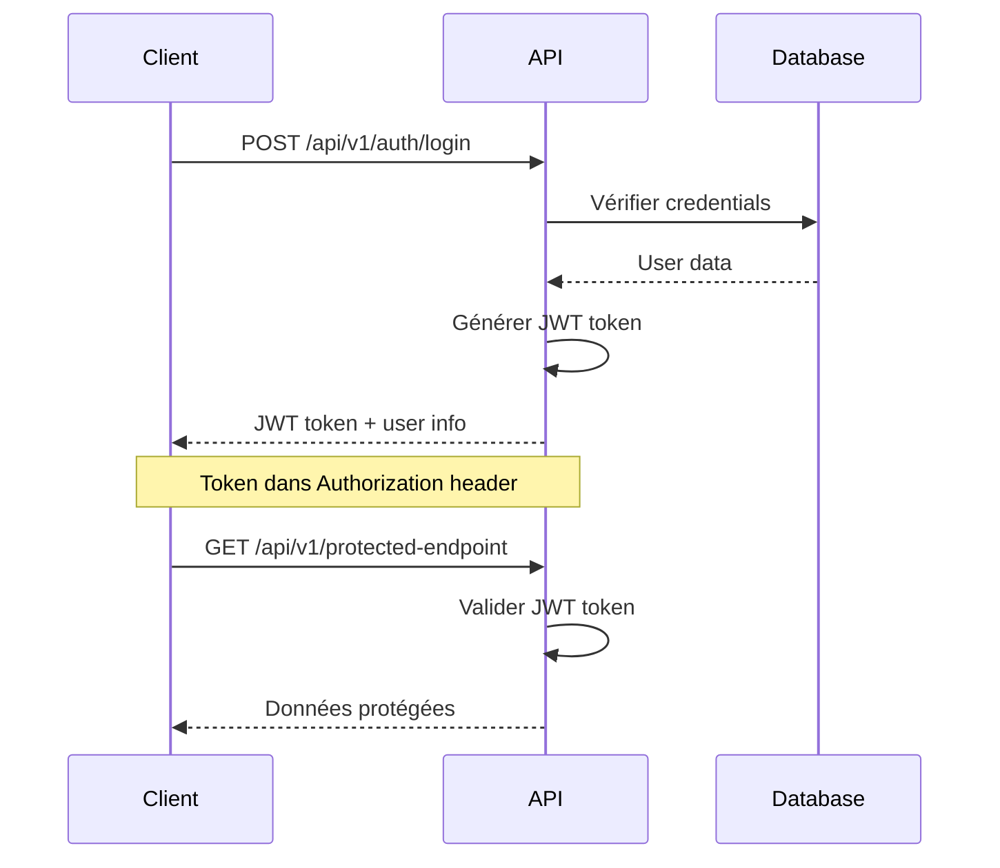

# Authentification et sécurité

## Vue d'ensemble

Flash Français Reborn utilise un système d'authentification basé sur JWT (JSON Web Tokens) avec gestion des rôles et protection des endpoints sensibles. Le système supporte trois types d'utilisateurs avec des permissions différenciées.

## Architecture de sécurité



## Modèle utilisateur

### Structure User
```python
class User(Base):
    id: int
    email: str  # Unique, indexed
    first_name: str
    last_name: str
    hashed_password: str
    role: UserRole  # Enum: 'teacher', 'student', 'admin'
    is_active: bool = True
    created_at: datetime
    updated_at: datetime
```

### Rôles utilisateur

#### Teacher (Enseignant)
- **Permissions principales:**
  - Création et gestion de progressions, séquences, séances
  - Upload et gestion de ressources pédagogiques
  - Génération de contenu via IA
  - Gestion des objectifs d'apprentissage
  - Accès au tableau de bord complet

#### Student (Étudiant)
- **Permissions limitées:**
  - Consultation des ressources assignées
  - Accès aux séquences et séances
  - Consultation des objectifs (lecture seule)
  - Pas de création/modification de contenu

#### Admin (Administrateur)
- **Permissions étendues:**
  - Toutes les permissions Teacher
  - Gestion des utilisateurs
  - Accès aux logs système
  - Configuration globale de l'application
  - Supervision des opérations IA

## Authentification JWT

### Flux d'authentification



### Endpoints d'authentification

#### POST `/api/v1/auth/login`
**Authentification utilisateur**

**Request:**
```json
{
  "email": "teacher@example.com",
  "password": "secure_password"
}
```

**Response (200):**
```json
{
  "access_token": "eyJ0eXAiOiJKV1QiLCJhbGciOiJIUzI1NiJ9...",
  "token_type": "bearer",
  "user": {
    "id": 1,
    "email": "teacher@example.com",
    "first_name": "Jean",
    "last_name": "Dupont",
    "role": "teacher",
    "is_active": true
  }
}
```

**Erreurs possibles:**
- `400`: Email ou mot de passe manquant
- `401`: Identifiants invalides
- `403`: Compte désactivé

#### POST `/api/v1/auth/register`
**Inscription nouvel utilisateur**

**Request:**
```json
{
  "email": "newteacher@example.com",
  "password": "secure_password",
  "first_name": "Marie",
  "last_name": "Martin",
  "role": "teacher"
}
```

**Response (201):**
```json
{
  "message": "Utilisateur créé avec succès",
  "user": {
    "id": 2,
    "email": "newteacher@example.com",
    "first_name": "Marie",
    "last_name": "Martin",
    "role": "teacher",
    "is_active": true
  }
}
```

#### GET `/api/v1/auth/me`
**Récupération profil utilisateur**

**Headers requis:**
```
Authorization: Bearer <jwt_token>
```

**Response (200):**
```json
{
  "id": 1,
  "email": "teacher@example.com",
  "first_name": "Jean",
  "last_name": "Dupont",
  "role": "teacher",
  "is_active": true,
  "created_at": "2024-01-15T10:30:00Z"
}
```

## Sécurité des mots de passe

### Hashage
- **Algorithme:** bcrypt avec salt
- **Configuration:** Cost factor = 12
- **Emplacement:** `backend/hashing.py`

```python
from passlib.context import CryptContext

pwd_context = CryptContext(schemes=["bcrypt"], deprecated="auto")

def hash_password(password: str) -> str:
    return pwd_context.hash(password)

def verify_password(plain_password: str, hashed_password: str) -> bool:
    return pwd_context.verify(plain_password, hashed_password)
```

### Politiques de sécurité
- **Longueur minimale:** 8 caractères
- **Complexité:** Au moins une lettre et un chiffre
- **Stockage:** Hash uniquement, jamais en clair
- **Reset:** Token temporaire pour réinitialisation

## Gestion des tokens JWT

### Configuration
```python
# backend/config.py
SECRET_KEY = "your-secret-key-here"
ALGORITHM = "HS256"
ACCESS_TOKEN_EXPIRE_MINUTES = 30
```

### Structure du token
```json
{
  "sub": "user@example.com",
  "user_id": 1,
  "role": "teacher",
  "exp": 1640995200,
  "iat": 1640993400
}
```

### Validation des tokens
```python
# backend/dependencies.py
def get_current_user(token: str = Depends(oauth2_scheme)) -> User:
    credentials_exception = HTTPException(
        status_code=401,
        detail="Could not validate credentials"
    )

    try:
        payload = jwt.decode(token, SECRET_KEY, algorithms=[ALGORITHM])
        email: str = payload.get("sub")
        if email is None:
            raise credentials_exception
    except JWTError:
        raise credentials_exception

    user = crud.get_user_by_email(db, email=email)
    if user is None or not user.is_active:
        raise credentials_exception

    return user
```

## Protection des endpoints

### Dépendances de sécurité

#### `get_current_user`
- Valide le token JWT
- Retourne l'utilisateur complet
- Utilisé pour les opérations nécessitant l'identité

#### `get_current_active_user`
- Étend `get_current_user`
- Vérifie que le compte est actif
- Utilisé pour la plupart des endpoints

#### `get_current_teacher`
- Vérifie le rôle "teacher" ou "admin"
- Utilisé pour les opérations de création/modification

#### `get_current_admin`
- Vérifie le rôle "admin"
- Utilisé pour les opérations administratives

### Exemple d'utilisation
```python
# backend/routers/resource.py
@router.post("/", response_model=ResourceRead)
def create_resource(
    resource: ResourceCreate,
    current_user: User = Depends(get_current_teacher),
    db: Session = Depends(get_db)
):
    return crud.create_resource(db=db, resource=resource, user_id=current_user.id)
```

## Autorisation basée sur les rôles

### Matrice des permissions

| Endpoint | Teacher | Student | Admin | Auth requis |
|----------|---------|---------|-------|-------------|
| GET /users | ❌ | ❌ | ✅ | ✅ |
| POST /progressions | ✅ | ❌ | ✅ | ✅ |
| GET /progressions | ✅ | ✅* | ✅ | ✅ |
| POST /resources | ✅ | ❌ | ✅ | ✅ |
| GET /resources | ✅ | ✅* | ✅ | ✅ |
| POST /ai/generate | ✅ | ❌ | ✅ | ✅ |
| GET /admin/logs | ❌ | ❌ | ✅ | ✅ |

*Les étudiants ne voient que les ressources qui leur sont assignées

### Vérification des rôles dans le code
```python
# backend/dependencies.py
def get_current_teacher(current_user: User = Depends(get_current_active_user)):
    if current_user.role not in [UserRole.TEACHER, UserRole.ADMIN]:
        raise HTTPException(
            status_code=403,
            detail="Not enough permissions"
        )
    return current_user

def get_current_admin(current_user: User = Depends(get_current_active_user)):
    if current_user.role != UserRole.ADMIN:
        raise HTTPException(
            status_code=403,
            detail="Admin access required"
        )
    return current_user
```

## Sécurité des données

### Validation des entrées
- **Pydantic models** pour toutes les entrées API
- **Sanitisation** automatique des champs texte
- **Validation des types** et contraintes

### Gestion des fichiers
- **Upload sécurisé** avec validation des types MIME
- **Stockage isolé** par utilisateur
- **Chemins relatifs** pour la portabilité
- **Scan antivirus** (à implémenter)

### Logs de sécurité
```python
# backend/security.py
def log_security_event(event_type: str, user_id: int, details: dict):
    """Log un événement de sécurité"""
    logger.info(f"SECURITY: {event_type} - User: {user_id} - {details}")
```

## Configuration CORS

### Paramètres CORS
```python
# backend/app.py
app.add_middleware(
    CORSMiddleware,
    allow_origins=["http://localhost:3000", "https://yourdomain.com"],
    allow_credentials=True,
    allow_methods=["GET", "POST", "PUT", "DELETE", "OPTIONS"],
    allow_headers=["*"],
)
```

### Gestion des origines
- **Développement:** `localhost:3000`
- **Production:** Domaines spécifiques
- **API externe:** Restrictions strictes

## Gestion des erreurs de sécurité

### Erreurs standardisées
```python
# Erreurs d'authentification
AUTH_ERRORS = {
    "INVALID_CREDENTIALS": "Identifiants invalides",
    "TOKEN_EXPIRED": "Token expiré",
    "TOKEN_INVALID": "Token invalide",
    "INSUFFICIENT_PERMISSIONS": "Permissions insuffisantes",
    "ACCOUNT_DISABLED": "Compte désactivé"
}
```

### Gestion des exceptions
```python
# backend/routers/auth.py
@app.exception_handler(HTTPException)
async def http_exception_handler(request, exc):
    if exc.status_code == 401:
        return JSONResponse(
            status_code=401,
            content={"detail": AUTH_ERRORS["TOKEN_INVALID"]}
        )
    return JSONResponse(
        status_code=exc.status_code,
        content={"detail": exc.detail}
    )
```

## Tests de sécurité

### Tests unitaires
```python
# backend/tests/test_auth.py
def test_login_success():
    # Test connexion réussie

def test_login_invalid_credentials():
    # Test identifiants invalides

def test_protected_endpoint_without_token():
    # Test accès sans token

def test_role_based_access():
    # Test permissions par rôle
```

### Tests d'intégration
- **Authentification complète** (login → token → accès)
- **Expiration des tokens**
- **Permissions par rôle**
- **Gestion des erreurs**

## Bonnes pratiques

### Développement
- **Ne jamais logger** les mots de passe
- **Utiliser HTTPS** en production
- **Valider toutes les entrées** utilisateur
- **Limiter les tentatives** de connexion

### Déploiement
- **Variables d'environnement** pour les secrets
- **Rotation régulière** des clés secrètes
- **Monitoring** des tentatives de connexion
- **Sauvegardes** des données utilisateur

### Maintenance
- **Audit de sécurité** régulier
- **Mise à jour** des dépendances
- **Monitoring** des logs de sécurité
- **Formation** des développeurs

## Limitations actuelles

### Points à améliorer
- **Refresh tokens** non implémentés
- **Rate limiting** à ajouter
- **2FA** non disponible
- **Audit trail** basique

### Évolutions planifiées
- **OAuth2** pour l'intégration tierce
- **API keys** pour les intégrations
- **Session management** avancé
- **Security headers** complets

---

*Authentification conçue pour la sécurité et l'évolutivité*