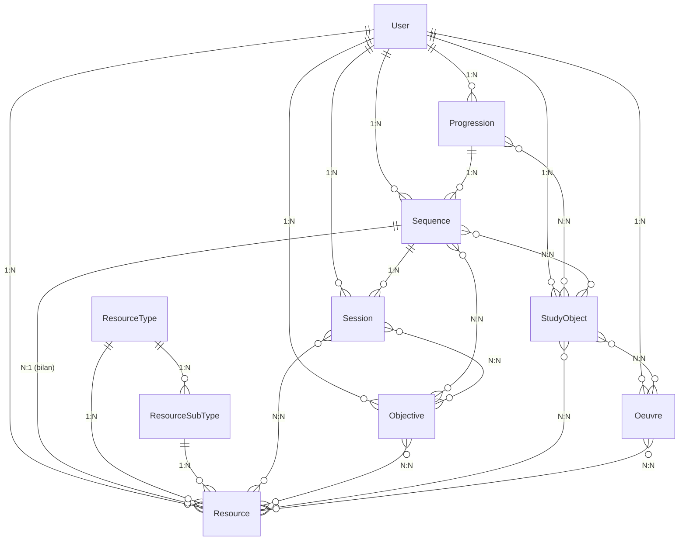

# Schéma base de données — Modèles et relations

## Vue d'ensemble

La base de données de Flash Français Reborn utilise PostgreSQL avec SQLAlchemy ORM. Le schéma est organisé autour de concepts pédagogiques fondamentaux avec des relations complexes pour supporter les workflows d'enseignement.

## Modèles principaux

### User (Utilisateurs)

```sql
CREATE TABLE users (
    id INTEGER PRIMARY KEY,
    email VARCHAR UNIQUE NOT NULL,
    first_name VARCHAR NOT NULL,
    last_name VARCHAR NOT NULL,
    hashed_password VARCHAR NOT NULL,
    role VARCHAR NOT NULL, -- 'teacher', 'student', 'admin'
    is_active BOOLEAN DEFAULT TRUE,
    created_at TIMESTAMP WITH TIME ZONE DEFAULT NOW(),
    updated_at TIMESTAMP WITH TIME ZONE DEFAULT NOW()
);
```

**Relations:**
- `1:N` avec Progression, Sequence, Session, Resource, Objective, StudyObject, Oeuvre

**Champs importants:**
- `role`: Enumération des rôles utilisateur
- `is_active`: Flag d'activation/désactivation
- Audit automatique avec timestamps

### Progression (Progressions pédagogiques)

```sql
CREATE TABLE progressions (
    id INTEGER PRIMARY KEY,
    user_id INTEGER REFERENCES users(id),
    title VARCHAR NOT NULL,
    description TEXT,
    created_at TIMESTAMP WITH TIME ZONE DEFAULT NOW(),
    updated_at TIMESTAMP WITH TIME ZONE DEFAULT NOW(),
    order INTEGER DEFAULT 0
);
```

**Relations:**
- `N:1` avec User
- `1:N` avec Sequence
- `N:N` avec StudyObject (via progression_study_object)

**Champs importants:**
- `order`: Ordre d'affichage dans l'interface
- `user_id`: Propriétaire de la progression

### Sequence (Séquences d'enseignement)

```sql
CREATE TABLE sequences (
    id INTEGER PRIMARY KEY,
    user_id INTEGER REFERENCES users(id),
    title VARCHAR NOT NULL,
    description TEXT,
    progression_id INTEGER REFERENCES progressions(id) NOT NULL,
    created_at TIMESTAMP WITH TIME ZONE DEFAULT NOW(),
    updated_at TIMESTAMP WITH TIME ZONE DEFAULT NOW(),
    order INTEGER DEFAULT 0,
    bilan_resource_id INTEGER REFERENCES resources(id)
);
```

**Relations:**
- `N:1` avec User et Progression
- `1:N` avec Session
- `N:N` avec Objective (via sequence_objective_association)
- `N:N` avec StudyObject (via sequence_study_object)
- `N:1` avec Resource (bilan de fin de séquence)

**Champs importants:**
- `order`: Ordre dans la progression
- `bilan_resource_id`: Ressource de synthèse de fin de séquence

### Session (Séances de cours)

```sql
CREATE TABLE sessions (
    id INTEGER PRIMARY KEY,
    user_id INTEGER REFERENCES users(id),
    title VARCHAR NOT NULL,
    description TEXT,
    sequence_id INTEGER REFERENCES sequences(id) NOT NULL,
    created_at TIMESTAMP WITH TIME ZONE DEFAULT NOW(),
    updated_at TIMESTAMP WITH TIME ZONE DEFAULT NOW(),
    order INTEGER DEFAULT 0,
    duration INTEGER, -- en minutes
    session_type VARCHAR -- 'cours', 'exercice', 'evaluation'
);
```

**Relations:**
- `N:1` avec User et Sequence
- `N:N` avec Objective (via session_objective_association)
- `N:N` avec Resource (via session_resource_association)

**Champs importants:**
- `duration`: Durée prévue de la séance
- `session_type`: Type de séance (cours, exercice, évaluation)
- `order`: Ordre dans la séquence

### Resource (Ressources pédagogiques)

```sql
CREATE TABLE resources (
    id INTEGER PRIMARY KEY,
    user_id INTEGER REFERENCES users(id),
    title VARCHAR NOT NULL,
    description TEXT,
    type_id INTEGER REFERENCES resource_types(id),
    sub_type_id INTEGER REFERENCES resource_sub_types(id),
    source_type VARCHAR NOT NULL, -- 'upload', 'ai_generated', 'manual'
    file_path VARCHAR,
    file_type VARCHAR,
    file_size INTEGER,
    created_at TIMESTAMP WITH TIME ZONE DEFAULT NOW(),
    updated_at TIMESTAMP WITH TIME ZONE DEFAULT NOW(),

    -- Métadonnées Docling (extraction PDF)
    docling_status VARCHAR DEFAULT 'pending',
    docling_md_path VARCHAR,
    docling_tables_path VARCHAR,
    docling_chars INTEGER,
    docling_sha256 VARCHAR,
    docling_version VARCHAR,
    ocr_used BOOLEAN DEFAULT FALSE,
    extracted_at TIMESTAMP WITH TIME ZONE,
    docling_error TEXT
);
```

**Relations:**
- `N:1` avec User, ResourceType, ResourceSubType
- `N:N` avec Objective (via objective_resource_association)
- `N:N` avec Session (via session_resource_association)
- `N:N` avec StudyObject (via study_object_resource)
- `N:N` avec Oeuvre (via oeuvre_resource_association)

**Champs importants:**
- `source_type`: Origine de la ressource (upload, IA, manuel)
- `file_path`: Chemin relatif vers le fichier
- Métadonnées Docling pour l'extraction PDF

### Objective (Objectifs d'apprentissage)

```sql
CREATE TABLE objectives (
    id INTEGER PRIMARY KEY,
    user_id INTEGER REFERENCES users(id),
    title VARCHAR NOT NULL,
    description TEXT,
    level VARCHAR, -- 'A1', 'A2', 'B1', 'B2', 'C1', 'C2'
    domain VARCHAR, -- 'grammaire', 'vocabulaire', 'litterature', etc.
    created_at TIMESTAMP WITH TIME ZONE DEFAULT NOW(),
    updated_at TIMESTAMP WITH TIME ZONE DEFAULT NOW()
);
```

**Relations:**
- `N:1` avec User
- `N:N` avec Sequence, Session, Resource

**Champs importants:**
- `level`: Niveau CECRL (A1-C2)
- `domain`: Domaine d'apprentissage

### StudyObject (Objets d'étude)

```sql
CREATE TABLE study_objects (
    id INTEGER PRIMARY KEY,
    user_id INTEGER REFERENCES users(id),
    title VARCHAR NOT NULL,
    content TEXT,
    source VARCHAR, -- 'manuel', 'extrait_litteraire', 'document_authentique'
    created_at TIMESTAMP WITH TIME ZONE DEFAULT NOW(),
    updated_at TIMESTAMP WITH TIME ZONE DEFAULT NOW()
);
```

**Relations:**
- `N:1` avec User
- `N:N` avec Progression, Sequence, Resource

**Champs importants:**
- `source`: Type de source du texte
- `content`: Contenu textuel de l'objet d'étude

### Oeuvre (Œuvres littéraires)

```sql
CREATE TABLE oeuvres (
    id INTEGER PRIMARY KEY,
    user_id INTEGER REFERENCES users(id),
    title VARCHAR NOT NULL,
    author VARCHAR,
    publication_year INTEGER,
    genre VARCHAR,
    summary TEXT,
    themes TEXT,
    created_at TIMESTAMP WITH TIME ZONE DEFAULT NOW(),
    updated_at TIMESTAMP WITH TIME ZONE DEFAULT NOW()
);
```

**Relations:**
- `N:1` avec User
- `N:N` avec Resource, StudyObject

**Champs importants:**
- Métadonnées littéraires complètes
- `themes`: Thèmes abordés dans l'œuvre

## Tables de référence

### ResourceType et ResourceSubType

```sql
CREATE TABLE resource_types (
    id INTEGER PRIMARY KEY,
    key VARCHAR UNIQUE NOT NULL, -- 'pdf', 'text', 'image', 'audio', 'video'
    name VARCHAR NOT NULL,
    description TEXT
);

CREATE TABLE resource_sub_types (
    id INTEGER PRIMARY KEY,
    type_id INTEGER REFERENCES resource_types(id),
    key VARCHAR NOT NULL, -- 'lecon', 'exercice', 'evaluation', etc.
    name VARCHAR NOT NULL,
    description TEXT,
    UNIQUE(type_id, key)
);
```

**Exemples de données:**
- Type: 'text', SubType: 'lecon', 'exercice', 'vocabulaire'
- Type: 'pdf', SubType: 'document', 'manuel'
- Type: 'ai', SubType: 'qcm', 'motscroises', 'analyse_texte'

## Tables d'association (Many-to-Many)

### sequence_objective_association
```sql
CREATE TABLE sequence_objective_association (
    sequence_id INTEGER REFERENCES sequences(id),
    objective_id INTEGER REFERENCES objectives(id),
    PRIMARY KEY (sequence_id, objective_id)
);
```

### session_objective_association
```sql
CREATE TABLE session_objective_association (
    session_id INTEGER REFERENCES sessions(id),
    objective_id INTEGER REFERENCES objectives(id),
    PRIMARY KEY (session_id, objective_id)
);
```

### session_resource_association
```sql
CREATE TABLE session_resource_association (
    session_id INTEGER REFERENCES sessions(id),
    resource_id INTEGER REFERENCES resources(id),
    PRIMARY KEY (session_id, resource_id)
);
```

### objective_resource_association
```sql
CREATE TABLE objective_resource_association (
    objective_id INTEGER REFERENCES objectives(id),
    resource_id INTEGER REFERENCES resources(id),
    PRIMARY KEY (objective_id, resource_id)
);
```

### progression_study_object
```sql
CREATE TABLE progression_study_object (
    progression_id INTEGER REFERENCES progressions(id),
    study_object_id INTEGER REFERENCES study_objects(id),
    PRIMARY KEY (progression_id, study_object_id)
);
```

### sequence_study_object
```sql
CREATE TABLE sequence_study_object (
    sequence_id INTEGER REFERENCES sequences(id),
    study_object_id INTEGER REFERENCES study_objects(id),
    PRIMARY KEY (sequence_id, study_object_id)
);
```

### study_object_resource
```sql
CREATE TABLE study_object_resource (
    study_object_id INTEGER REFERENCES study_objects(id),
    resource_id INTEGER REFERENCES resources(id),
    PRIMARY KEY (study_object_id, resource_id)
);
```

### study_object_oeuvre
```sql
CREATE TABLE study_object_oeuvre (
    study_object_id INTEGER REFERENCES study_objects(id),
    oeuvre_id INTEGER REFERENCES oeuvres(id),
    PRIMARY KEY (study_object_id, oeuvre_id)
);
```

### oeuvre_resource_association
```sql
CREATE TABLE oeuvre_resource_association (
    oeuvre_id INTEGER REFERENCES oeuvres(id),
    resource_id INTEGER REFERENCES resources(id),
    PRIMARY KEY (oeuvre_id, resource_id)
);
```

## Schéma relationnel complet



## Index et optimisations

### Index principaux
```sql
-- Index pour les recherches fréquentes
CREATE INDEX idx_users_email ON users(email);
CREATE INDEX idx_users_role ON users(role);
CREATE INDEX idx_progressions_user_id ON progressions(user_id);
CREATE INDEX idx_sequences_progression_id ON sequences(progression_id);
CREATE INDEX idx_sessions_sequence_id ON sessions(sequence_id);
CREATE INDEX idx_resources_user_id ON resources(user_id);
CREATE INDEX idx_resources_type_id ON resources(type_id);
CREATE INDEX idx_resources_source_type ON resources(source_type);

-- Index pour les métadonnées Docling
CREATE INDEX idx_resources_docling_status ON resources(docling_status);
CREATE INDEX idx_resources_docling_sha256 ON resources(docling_sha256);

-- Index pour les associations
CREATE INDEX idx_sequence_objective_sequence_id ON sequence_objective_association(sequence_id);
CREATE INDEX idx_sequence_objective_objective_id ON sequence_objective_association(objective_id);
CREATE INDEX idx_session_resource_session_id ON session_resource_association(session_id);
CREATE INDEX idx_session_resource_resource_id ON session_resource_association(resource_id);
```

## Migrations et évolution

### Alembic
- Migrations versionnées dans `backend/alembic/versions/`
- Scripts de migration automatique
- Support du rollback
- Historique complet des changements

### Bonnes pratiques
- **Chemins relatifs**: Tous les `file_path` sont relatifs à `UPLOADS_BASE_DIR`
- **Audit**: Champs `created_at` et `updated_at` sur toutes les tables
- **Cascades**: Suppression en cascade pour maintenir l'intégrité
- **Contraintes**: Clés étrangères et contraintes de domaine
- **Indexation**: Index optimisés pour les requêtes fréquentes

## Sécurité et conformité

### Protection des données
- Pas de données sensibles en clair
- Hashage des mots de passe (bcrypt)
- Validation des entrées utilisateur
- Logs d'audit pour les opérations sensibles

### Sauvegarde et récupération
- Sauvegardes régulières de la base PostgreSQL
- Export des métadonnées critiques
- Récupération point-in-time possible
- Test des procédures de restauration

## Performance

### Optimisations
- Index composés pour les requêtes complexes
- Pagination des résultats volumineux
- Cache des requêtes fréquentes (planifié)
- Optimisation des jointures many-to-many

### Métriques de performance
- Temps de réponse des requêtes courantes
- Taille de la base de données
- Nombre de connexions simultanées
- Utilisation des ressources système

---

*Base de données conçue pour supporter la complexité pédagogique*