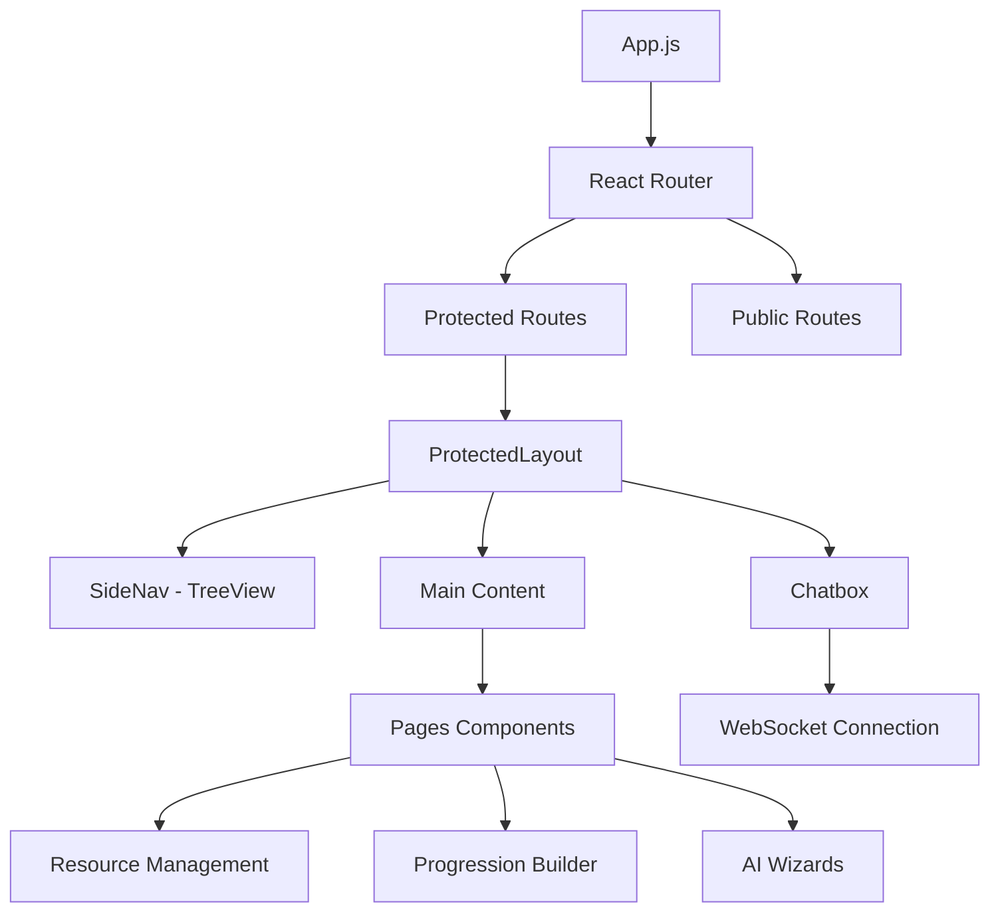
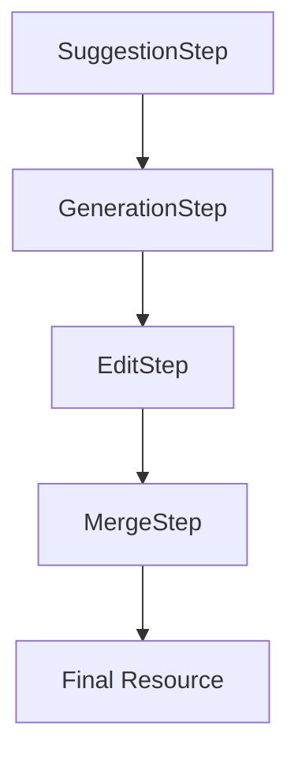

# Architecture Frontend — React et composants

## Vue d'ensemble

Le frontend de Flash Français Reborn est une application React moderne utilisant Material-UI, React Router et une architecture de composants modulaires. L'application suit les principes de séparation des responsabilités avec une gestion d'état centralisée et des services API dédiés.

## Architecture générale



## Structure des dossiers

### Organisation principale
```
frontend/src/
├── App.js                          # Application principale
├── index.js                        # Point d'entrée React
├── theme.js                        # Configuration Material-UI
├── components/                     # Composants réutilisables
│   ├── SideNav/                    # Navigation latérale
│   ├── Chatbox/                    # Chat en temps réel
│   ├── ResourceGenerationWizard/   # Assistant IA
│   ├── DynamicAIForm/              # Formulaires dynamiques
│   ├── editors/                    # Éditeurs de contenu
│   ├── objectives/                 # Composants objectifs
│   ├── oeuvres/                    # Composants œuvres
│   └── ...                         # Autres composants
├── pages/                          # Pages de l'application
│   ├── auth/                       # Authentification
│   ├── dashboard/                  # Tableau de bord
│   ├── resources/                  # Gestion ressources
│   ├── progressions/               # Progressions
│   ├── sequences/                  # Séquences
│   ├── sessions/                   # Séances
│   ├── objectives/                 # Objectifs
│   ├── studyObjects/               # Objets d'étude
│   └── oeuvres/                    # Œuvres
├── contexts/                       # Contextes React
│   ├── AuthContext.js              # Authentification
│   └── TreeDataContext.js          # Données arborescentes
├── services/                       # Services API
│   ├── api.js                      # Client HTTP axios
│   ├── authService.js              # Authentification
│   └── resourceService.js          # Ressources
├── styles/                         # Styles CSS
└── utils/                          # Utilitaires
```

## Configuration et setup

### package.json - Dépendances principales
```json
{
  "dependencies": {
    "@mui/material": "^5.17.1",           // Material-UI components
    "@mui/icons-material": "^5.14.19",    // Material-UI icons
    "@mui/x-data-grid": "^6.6.0",         // Data grid component
    "@mui/x-tree-view": "^7.28.1",        // Tree view component
    "react": "^18.2.0",                   // React core
    "react-router-dom": "^6.20.1",        // Routing
    "axios": "^1.6.2",                    // HTTP client
    "react-beautiful-dnd": "^13.1.1",     // Drag & drop
    "react-dnd": "^16.0.1",               // Drag & drop core
    "@tinymce/tinymce-react": "^6.2.1",   // Rich text editor
    "tinymce": "^7.9.1"                   // TinyMCE editor
  }
}
```

### Configuration Material-UI
```javascript
// frontend/src/theme.js
import { createTheme } from '@mui/material/styles';

const theme = createTheme({
  palette: {
    primary: { main: '#1976d2' },
    secondary: { main: '#dc004e' },
  },
  typography: {
    fontFamily: '"Roboto", "Helvetica", "Arial", sans-serif',
  },
  components: {
    MuiButton: {
      styleOverrides: {
        root: { borderRadius: 8 },
      },
    },
  },
});

export default theme;
```

## Gestion d'état et contextes

### AuthContext - Authentification globale
```javascript
// frontend/src/contexts/AuthContext.js
import React, { createContext, useContext, useState, useEffect } from 'react';
import api from '../services/api';

const AuthContext = createContext();

export const useAuth = () => {
  const context = useContext(AuthContext);
  if (!context) {
    throw new Error('useAuth must be used within an AuthProvider');
  }
  return context;
};

export const AuthProvider = ({ children }) => {
  const [user, setUser] = useState(null);
  const [token, setToken] = useState(localStorage.getItem('token'));
  const [isAuthenticated, setIsAuthenticated] = useState(false);
  const [loading, setLoading] = useState(true);

  // Login function
  const login = async (email, password) => {
    try {
      const response = await api.post('/auth/login', { email, password });
      const { access_token, user: userData } = response.data;

      setToken(access_token);
      setUser(userData);
      setIsAuthenticated(true);
      localStorage.setItem('token', access_token);

      return { success: true };
    } catch (error) {
      return { success: false, error: error.response?.data?.detail };
    }
  };

  // Logout function
  const logout = () => {
    setToken(null);
    setUser(null);
    setIsAuthenticated(false);
    localStorage.removeItem('token');
  };

  // Check authentication on app load
  useEffect(() => {
    const checkAuth = async () => {
      if (token) {
        try {
          const response = await api.get('/auth/me');
          setUser(response.data);
          setIsAuthenticated(true);
        } catch (error) {
          logout(); // Token invalid
        }
      }
      setLoading(false);
    };

    checkAuth();
  }, [token]);

  return (
    <AuthContext.Provider value={{
      user,
      token,
      isAuthenticated,
      loading,
      login,
      logout
    }}>
      {children}
    </AuthContext.Provider>
  );
};
```

### TreeDataContext - Données arborescentes
```javascript
// frontend/src/contexts/TreeDataContext.js
import React, { createContext, useContext, useState, useCallback } from 'react';
import api from '../services/api';

const TreeDataContext = createContext();

export const useTreeData = () => useContext(TreeDataContext);

export const TreeDataProvider = ({ children }) => {
  const [treeData, setTreeData] = useState({
    id: 'root',
    name: 'Progressions',
    type: 'root',
    children: []
  });
  const [isTreeLoading, setIsTreeLoading] = useState(true);
  const [treeError, setTreeError] = useState(null);

  const refreshTreeData = useCallback(async () => {
    setIsTreeLoading(true);
    setTreeError(null);

    try {
      const response = await api.get('/progressions/');
      const progressions = response.data;

      const formattedProgressions = progressions.map(prog => ({
        id: prog.id,
        name: prog.title,
        type: 'progression',
        description: prog.description,
        order: prog.order,
        children: [{ id: `loading-${prog.id}`, name: 'Chargement...', type: 'loading' }]
      }));

      setTreeData(prevData => ({ ...prevData, children: formattedProgressions }));
    } catch (error) {
      setTreeError(error.message);
      setTreeData(prevData => ({ ...prevData, children: [] }));
    } finally {
      setIsTreeLoading(false);
    }
  }, []);

  return (
    <TreeDataContext.Provider value={{
      treeData,
      isTreeLoading,
      treeError,
      refreshTreeData
    }}>
      {children}
    </TreeDataContext.Provider>
  );
};
```

## Architecture de routage

### App.js - Configuration des routes
```javascript
// frontend/src/App.js
import { Routes, Route, Navigate } from 'react-router-dom';
import { useAuth } from './contexts/AuthContext';
import ProtectedLayout from './components/ProtectedLayout';
import LandingPage from './pages/LandingPage';
import Login from './pages/auth/Login';
// ... autres imports

function App() {
  const { isAuthenticated } = useAuth();

  return (
    <Routes>
      {/* Routes publiques */}
      <Route path="/" element={<LandingPage />} />
      <Route path="/login" element={<Login />} />
      <Route path="/register" element={<Register />} />
      <Route path="/forgot-password" element={<ForgotPassword />} />

      {/* Routes protégées */}
      <Route path="/dashboard" element={
        <ProtectedRoute>
          <ProtectedLayout />
        </ProtectedRoute>
      }>
        <Route index element={<Dashboard />} />
        <Route path="admin/llm-logs" element={<AdminLLMLogs />} />
        <Route path="progressions/new" element={<ProgressionBuilder />} />
        <Route path="progressions/:id" element={<ProgressionDetailPage />} />
        <Route path="progressions/edit/:id" element={<ProgressionEditPage />} />
      </Route>

      {/* Routes ressources */}
      <Route path="/resources" element={
        <ProtectedRoute>
          <ProtectedLayout />
        </ProtectedRoute>
      }>
        <Route index element={<ResourceList />} />
        <Route path="new" element={<NewResource />} />
        <Route path="edit/:id" element={<ResourceEdit />} />
        <Route path="view/:id" element={<ResourceView />} />
      </Route>

      {/* Autres routes similaires pour progressions, sequences, etc. */}

      {/* Redirection par défaut */}
      <Route path="*" element={
        <Navigate to={isAuthenticated ? "/dashboard" : "/"} replace />
      } />
    </Routes>
  );
}
```

### ProtectedRoute - Protection des routes
```javascript
function ProtectedRoute({ children }) {
  const { isAuthenticated } = useAuth();
  const location = useLocation();

  if (!isAuthenticated) {
    return <Navigate to="/login" state={{ from: location }} replace />;
  }

  return children;
}
```

## Layout protégé

### ProtectedLayout - Structure principale
```javascript
// Extrait de frontend/src/App.js
function ProtectedLayout() {
  const { user, token, logout } = useAuth();
  const navigate = useNavigate();
  const location = useLocation();
  const theme = useTheme();

  // État pour la navigation
  const [isSidebarOpen, setIsSidebarOpen] = useState(true);
  const [isChatboxOpen, setIsChatboxOpen] = useState(false);

  // État pour les données arborescentes
  const [treeData, setTreeData] = useState({
    id: 'root',
    name: 'Progressions',
    type: 'root',
    children: []
  });

  return (
    <Box sx={{ display: 'flex', minHeight: '100vh' }}>
      <CssBaseline />

      {/* AppBar fixe */}
      <MuiAppBar position="fixed" open={isSidebarOpen}>
        <Toolbar>
          {/* Navigation et boutons utilisateur */}
        </Toolbar>
      </MuiAppBar>

      {/* TreeDataContext pour la navigation */}
      <TreeDataContext.Provider value={{ treeData, isTreeLoading, treeError, refreshTreeData }}>
        <SideNav
          open={isSidebarOpen}
          handleDrawerOpen={() => setIsSidebarOpen(true)}
          handleDrawerClose={() => setIsSidebarOpen(false)}
        />

        {/* Contenu principal */}
        <Box component="main" sx={{ flexGrow: 1, p: 3 }}>
          <Outlet /> {/* Contenu des routes enfants */}
        </Box>

        {/* Chatbox flottante */}
        <Fab
          color="secondary"
          onClick={() => setIsChatboxOpen(!isChatboxOpen)}
          sx={{ position: 'fixed', bottom: 16, right: 16 }}
        >
          <ChatIcon />
        </Fab>

        <Drawer
          anchor="right"
          open={isChatboxOpen}
          onClose={() => setIsChatboxOpen(false)}
        >
          <Chatbox onClose={() => setIsChatboxOpen(false)} />
        </Drawer>
      </TreeDataContext.Provider>
    </Box>
  );
}
```

## Composants principaux

### SideNav - Navigation arborescente
```javascript
// frontend/src/components/SideNav/index.js
import React, { useState, useEffect } from 'react';
import { useNavigate, useLocation } from 'react-router-dom';
import { Drawer, List, ListItem, ListItemText } from '@mui/material';
import { TreeView, TreeItem } from '@mui/x-tree-view';
import { useTreeData } from '../../contexts/TreeDataContext';

const drawerWidth = 280;

function SideNav({ open, handleDrawerOpen, handleDrawerClose }) {
  const navigate = useNavigate();
  const location = useLocation();
  const { treeData, isTreeLoading, treeError, refreshTreeData } = useTreeData();

  // Gestion de l'expansion des nœuds
  const [expanded, setExpanded] = useState([]);

  const handleNodeToggle = (event, nodeIds) => {
    setExpanded(nodeIds);
  };

  const handleNodeSelect = (event, nodeId) => {
    // Navigation basée sur le type de nœud
    const node = findNodeById(treeData, nodeId);
    if (node) {
      switch (node.type) {
        case 'progression':
          navigate(`/progressions/${node.id}`);
          break;
        case 'sequence':
          navigate(`/sequences/${node.id}`);
          break;
        case 'session':
          navigate(`/sessions/${node.id}`);
          break;
        default:
          break;
      }
    }
  };

  return (
    <Drawer
      variant="persistent"
      anchor="left"
      open={open}
      sx={{
        width: drawerWidth,
        flexShrink: 0,
        '& .MuiDrawer-paper': {
          width: drawerWidth,
          boxSizing: 'border-box',
        },
      }}
    >
      <TreeView
        expanded={expanded}
        selected={location.pathname}
        onNodeToggle={handleNodeToggle}
        onNodeSelect={handleNodeSelect}
      >
        {renderTree(treeData)}
      </TreeView>
    </Drawer>
  );
}
```

### ResourceGenerationWizard - Assistant IA

#### Architecture du wizard


#### Structure des composants
```
ResourceGenerationWizard/
├── index.js                          # Composant principal
├── components/
│   ├── SuggestionStep.jsx           # Sélection des suggestions
│   ├── GenerationStep.jsx           # Génération IA
│   ├── EditStep.jsx                 # Édition du contenu
│   └── MergeStep.jsx                # Fusion et finalisation
├── hooks/
│   ├── useResourceGeneration.js     # Logique de génération
│   └── useAIForm.js                 # Gestion des formulaires IA
├── services/
│   ├── aiService.js                 # API IA
│   └── resourceService.js           # API ressources
└── utils/
    ├── validation.js                # Validation des données
    └── templates.js                 # Templates de formulaires
```

#### Exemple de hook personnalisé
```javascript
// frontend/src/components/ResourceGenerationWizard/hooks/useResourceGeneration.js
import { useState, useCallback } from 'react';
import { useAuth } from '../../../contexts/AuthContext';
import api from '../../../services/api';

export const useResourceGeneration = () => {
  const { user } = useAuth();
  const [loading, setLoading] = useState(false);
  const [error, setError] = useState(null);
  const [currentStep, setCurrentStep] = useState(0);

  const generateResource = useCallback(async (config) => {
    setLoading(true);
    setError(null);

    try {
      // Étape 1: Génération du contenu IA
      const generationResponse = await api.post('/ai/generate', {
        type_key: config.type,
        subtype_key: config.subtype,
        input_variables: config.variables
      });

      // Étape 2: Fusion avec template
      const mergeResponse = await api.post('/ai/merge-resource', {
        type_key: config.type,
        subtype_key: config.subtype,
        data_json: generationResponse.data.content,
        model_path: config.templatePath,
        user_id: user.id
      });

      return mergeResponse.data;
    } catch (err) {
      setError(err.response?.data?.detail || 'Erreur de génération');
      throw err;
    } finally {
      setLoading(false);
    }
  }, [user]);

  return {
    generateResource,
    loading,
    error,
    currentStep,
    setCurrentStep
  };
};
```

## Services API

### Configuration axios
```javascript
// frontend/src/services/api.js
import axios from 'axios';

// Configuration de base
const api = axios.create({
  baseURL: process.env.REACT_APP_API_BASE_URL || 'http://localhost:10000/api/v1',
  timeout: 30000,
});

// Intercepteur pour ajouter le token JWT
api.interceptors.request.use(
  (config) => {
    const token = localStorage.getItem('token');
    if (token) {
      config.headers.Authorization = `Bearer ${token}`;
    }
    return config;
  },
  (error) => Promise.reject(error)
);

// Intercepteur pour gérer les erreurs d'authentification
api.interceptors.response.use(
  (response) => response,
  (error) => {
    if (error.response?.status === 401) {
      localStorage.removeItem('token');
      window.location.href = '/login';
    }
    return Promise.reject(error);
  }
);

export default api;
```

### Service de ressources
```javascript
// frontend/src/services/resourceService.js
import api from './api';

export const resourceService = {
  // Récupération des ressources
  async getResources(params = {}) {
    const response = await api.get('/resources/', { params });
    return response.data;
  },

  // Création d'une ressource
  async createResource(resourceData) {
    const formData = new FormData();

    // Ajout des champs texte
    Object.keys(resourceData).forEach(key => {
      if (key !== 'file') {
        formData.append(key, resourceData[key]);
      }
    });

    // Ajout du fichier si présent
    if (resourceData.file) {
      formData.append('file', resourceData.file);
    }

    const response = await api.post('/resources/', formData, {
      headers: { 'Content-Type': 'multipart/form-data' }
    });

    return response.data;
  },

  // Mise à jour d'une ressource
  async updateResource(id, resourceData) {
    const response = await api.put(`/resources/${id}`, resourceData);
    return response.data;
  },

  // Suppression d'une ressource
  async deleteResource(id) {
    const response = await api.delete(`/resources/${id}`);
    return response.data;
  },

  // Statut d'extraction PDF
  async getPdfExtractionStatus(id) {
    const response = await api.get(`/resources/${id}/docling`);
    return response.data;
  },

  // Ré-extraction PDF
  async reextractPdf(id, options = {}) {
    const formData = new FormData();
    formData.append('ocr', options.ocr || false);
    formData.append('force', options.force || false);

    const response = await api.post(`/resources/${id}/reextract`, formData);
    return response.data;
  }
};
```

## Gestion des formulaires

### DynamicAIForm - Formulaires générés dynamiquement
```javascript
// frontend/src/components/DynamicAIForm/index.js
import React, { useState, useEffect } from 'react';
import { TextField, Select, Checkbox, FormControl } from '@mui/material';

const DynamicAIForm = ({ schema, onChange, initialValues = {} }) => {
  const [values, setValues] = useState(initialValues);

  const handleFieldChange = (fieldName, value) => {
    const newValues = { ...values, [fieldName]: value };
    setValues(newValues);
    onChange(newValues);
  };

  const renderField = (fieldName, fieldSchema) => {
    const commonProps = {
      key: fieldName,
      name: fieldName,
      value: values[fieldName] || '',
      onChange: (e) => handleFieldChange(fieldName, e.target.value),
      label: fieldSchema.title || fieldName,
      required: fieldSchema.required || false
    };

    switch (fieldSchema.type) {
      case 'string':
        return <TextField {...commonProps} />;

      case 'select':
        return (
          <FormControl>
            <Select {...commonProps}>
              {fieldSchema.options?.map(option => (
                <MenuItem key={option.value} value={option.value}>
                  {option.label}
                </MenuItem>
              ))}
            </Select>
          </FormControl>
        );

      case 'boolean':
        return (
          <FormControlLabel
            control={
              <Checkbox
                checked={values[fieldName] || false}
                onChange={(e) => handleFieldChange(fieldName, e.target.checked)}
              />
            }
            label={fieldSchema.title || fieldName}
          />
        );

      default:
        return <TextField {...commonProps} />;
    }
  };

  return (
    <Box sx={{ display: 'flex', flexDirection: 'column', gap: 2 }}>
      {Object.entries(schema.properties || {}).map(([fieldName, fieldSchema]) =>
        renderField(fieldName, fieldSchema)
      )}
    </Box>
  );
};

export default DynamicAIForm;
```

## Gestion des erreurs

### ErrorBoundary - Gestion globale des erreurs
```javascript
// frontend/src/components/ErrorBoundary.js
import React from 'react';

class ErrorBoundary extends React.Component {
  constructor(props) {
    super(props);
    this.state = { hasError: false, error: null };
  }

  static getDerivedStateFromError(error) {
    return { hasError: true, error };
  }

  componentDidCatch(error, errorInfo) {
    // Log l'erreur
    console.error('ErrorBoundary caught an error:', error, errorInfo);

    // Envoi à un service de monitoring
    if (process.env.NODE_ENV === 'production') {
      // logErrorToService(error, errorInfo);
    }
  }

  render() {
    if (this.state.hasError) {
      return (
        <Box sx={{ p: 3, textAlign: 'center' }}>
          <Typography variant="h5" color="error">
            Une erreur inattendue s'est produite
          </Typography>
          <Typography variant="body1" sx={{ mt: 2 }}>
            Veuillez rafraîchir la page ou contacter le support si le problème persiste.
          </Typography>
          <Button
            variant="contained"
            onClick={() => window.location.reload()}
            sx={{ mt: 2 }}
          >
            Rafraîchir la page
          </Button>
        </Box>
      );
    }

    return this.props.children;
  }
}

export default ErrorBoundary;
```

## Optimisations de performance

### Code splitting et lazy loading
```javascript
// frontend/src/App.js
import React, { Suspense, lazy } from 'react';

// Lazy loading des composants
const Dashboard = lazy(() => import('./pages/Dashboard'));
const ProgressionBuilder = lazy(() => import('./pages/progressions/ProgressionBuilder'));
const ResourceGenerationWizard = lazy(() =>
  import('./components/ResourceGenerationWizard')
);

// Utilisation avec Suspense
<Route
  path="/dashboard"
  element={
    <ProtectedRoute>
      <ProtectedLayout />
    </ProtectedRoute>
  }
>
  <Route index element={
    <Suspense fallback={<CircularProgress />}>
      <Dashboard />
    </Suspense>
  } />
  <Route path="progressions/new" element={
    <Suspense fallback={<CircularProgress />}>
      <ProgressionBuilder />
    </Suspense>
  } />
</Route>
```

### Memoization des composants
```javascript
// frontend/src/components/ResourceCard.js
import React, { memo } from 'react';

const ResourceCard = memo(({ resource, onEdit, onDelete }) => {
  return (
    <Card>
      <CardContent>
        <Typography variant="h6">{resource.title}</Typography>
        <Typography variant="body2">{resource.description}</Typography>
        {/* Autres éléments */}
      </CardContent>
      <CardActions>
        <Button onClick={() => onEdit(resource.id)}>Éditer</Button>
        <Button onClick={() => onDelete(resource.id)}>Supprimer</Button>
      </CardActions>
    </Card>
  );
});

export default ResourceCard;
```

## Tests et qualité

### Structure des tests
```
frontend/src/
├── __tests__/                    # Tests unitaires
│   ├── components/
│   ├── pages/
│   ├── services/
│   └── utils/
├── __mocks__/                    # Mocks pour les tests
└── setupTests.js                 # Configuration Jest
```

### Exemple de test
```javascript
// frontend/src/__tests__/components/ResourceCard.test.js
import React from 'react';
import { render, screen, fireEvent } from '@testing-library/react';
import ResourceCard from '../../components/ResourceCard';

describe('ResourceCard', () => {
  const mockResource = {
    id: 1,
    title: 'Test Resource',
    description: 'Test description'
  };

  const mockOnEdit = jest.fn();
  const mockOnDelete = jest.fn();

  it('renders resource information', () => {
    render(
      <ResourceCard
        resource={mockResource}
        onEdit={mockOnEdit}
        onDelete={mockOnDelete}
      />
    );

    expect(screen.getByText('Test Resource')).toBeInTheDocument();
    expect(screen.getByText('Test description')).toBeInTheDocument();
  });

  it('calls onEdit when edit button is clicked', () => {
    render(
      <ResourceCard
        resource={mockResource}
        onEdit={mockOnEdit}
        onDelete={mockOnDelete}
      />
    );

    const editButton = screen.getByText('Éditer');
    fireEvent.click(editButton);

    expect(mockOnEdit).toHaveBeenCalledWith(1);
  });
});
```

## Déploiement et build

### Configuration de production
```javascript
// frontend/package.json
{
  "scripts": {
    "build": "react-scripts build",
    "test": "react-scripts test",
    "eject": "react-scripts eject"
  }
}
```

### Variables d'environnement
```javascript
// frontend/.env.production
REACT_APP_API_BASE_URL=https://api.flashfrancais.com/api/v1
REACT_APP_ENVIRONMENT=production
```

### Optimisations de build
```javascript
// frontend/package.json
{
  "browserslist": {
    "production": [
      ">0.2%",
      "not dead",
      "not op_mini all"
    ],
    "development": [
      "last 1 chrome version",
      "last 1 firefox version",
      "last 1 safari version"
    ]
  }
}
```

## Bonnes pratiques

### Accessibilité
- Utilisation des composants Material-UI avec accessibilité intégrée
- Labels appropriés pour tous les champs de formulaire
- Navigation au clavier fonctionnelle
- Contraste des couleurs suffisant

### Responsive design
- Utilisation du système de breakpoints Material-UI
- Composants adaptatifs pour mobile et tablette
- Grille flexible pour les layouts

### Performance
- Lazy loading des routes et composants
- Memoization des composants coûteux
- Optimisation des images et ressources
- Cache des requêtes API

### Sécurité
- Validation des entrées utilisateur
- Sanitisation du HTML
- Protection CSRF via les tokens JWT
- Headers de sécurité appropriés

## Évolutions planifiées

### Améliorations UX
- **Mode hors ligne** pour consultation des ressources
- **Notifications push** pour les tâches de fond
- **Thème sombre** personnalisable
- **Internationalisation** (i18n)

### Nouvelles fonctionnalités
- **Collaboration temps réel** sur les ressources
- **Intégration LMS** (Moodle, Canvas)
- **Analytics d'utilisation** pour les enseignants
- **API publique** pour les intégrations tierces

### Optimisations techniques
- **Migration vers Next.js** pour le SSR
- **Service Worker** pour le PWA
- **WebAssembly** pour les traitements lourds
- **GraphQL** pour optimiser les requêtes

---

*Architecture frontend conçue pour l'évolutivité et l'expérience utilisateur*