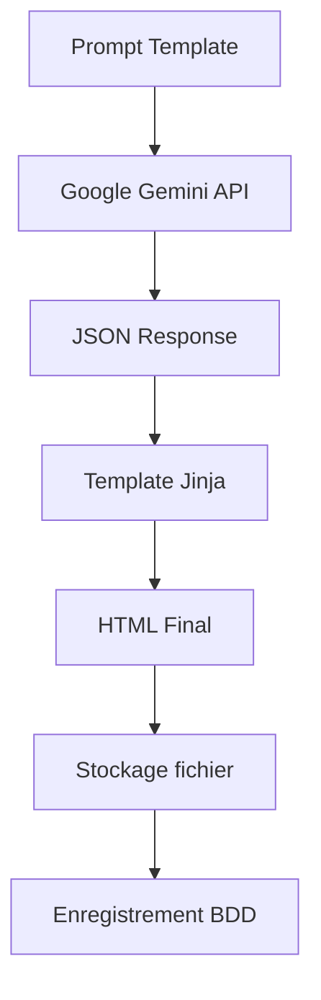
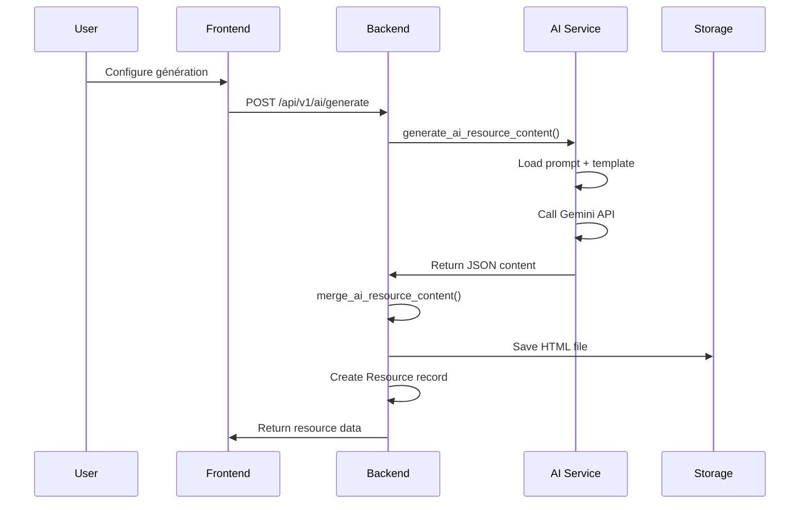
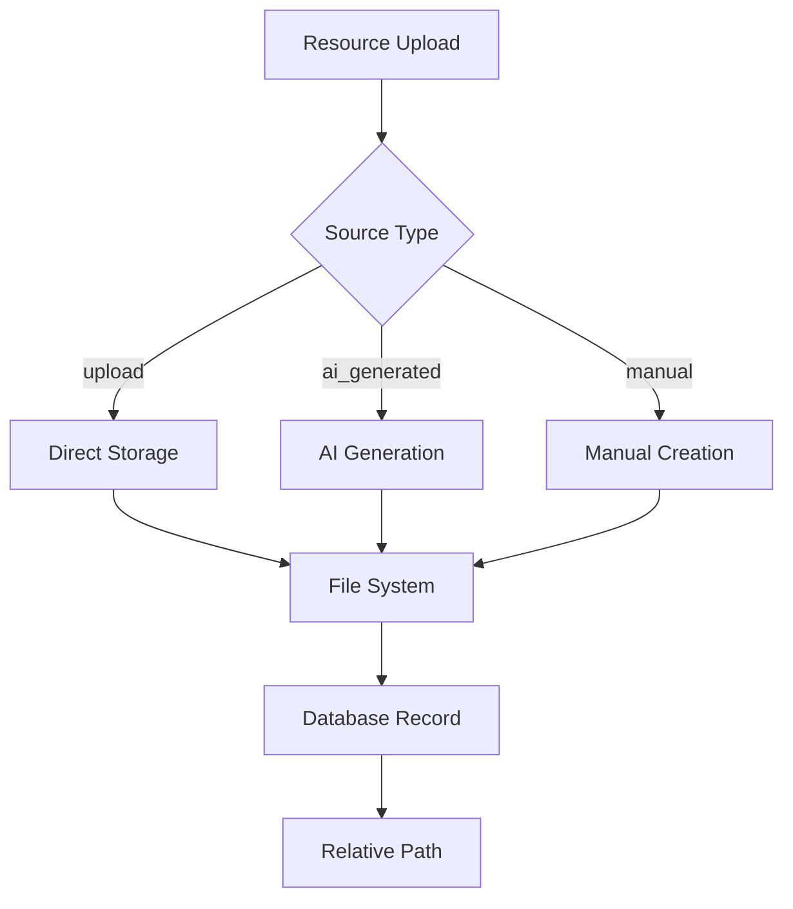
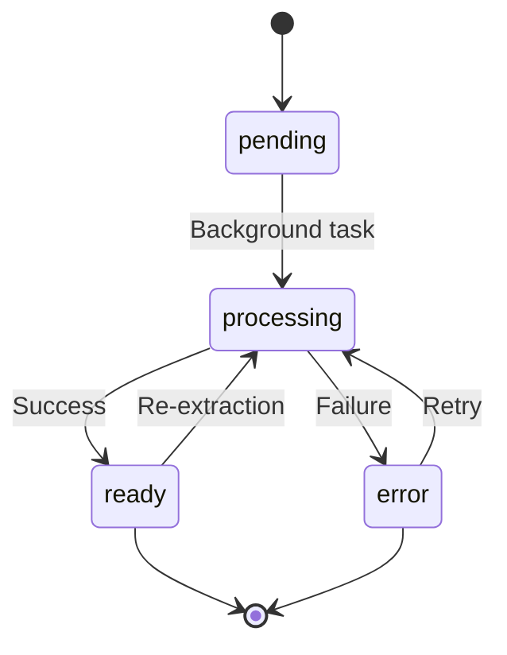

# Ressources — Modèle, IA et gestion avancée

## Vue d'ensemble

Le système de ressources de Flash Français Reborn gère différents types de contenu pédagogique avec un support avancé pour l'intelligence artificielle, l'extraction PDF et le stockage distribué.

## Modèle `Resource` complet

### Structure de base
```python
# backend/models/resource.py
class Resource(Base):
    id: int
    user_id: int  # Propriétaire
    title: str
    description: str
    type_id: int  # Référence ResourceType
    sub_type_id: int  # Référence ResourceSubType
    source_type: str  # 'upload', 'ai_generated', 'manual'
    file_path: str  # Chemin relatif
    file_type: str  # MIME type
    file_size: int  # Taille en octets
    created_at: datetime
    updated_at: datetime
```

### Métadonnées Docling (extraction PDF)
```python
# Champs d'extraction PDF
docling_status: str  # 'pending', 'processing', 'ready', 'error'
docling_md_path: str  # Chemin vers markdown extrait
docling_tables_path: str  # Chemin vers tables HTML
docling_chars: int  # Nombre de caractères extraits
docling_sha256: str  # Hash pour déduplication
docling_version: str  # Version de l'extracteur
ocr_used: bool  # OCR activé
extracted_at: datetime  # Date d'extraction
docling_error: str  # Message d'erreur si échec
```

## Types et sous-types de ressources

### ResourceType (Types principaux)
```sql
-- Exemples de données
('pdf', 'Document PDF', 'Documents PDF uploadés')
('text', 'Texte', 'Contenu textuel')
('image', 'Image', 'Images et illustrations')
('audio', 'Audio', 'Fichiers audio')
('video', 'Vidéo', 'Contenu vidéo')
('ai', 'IA Généré', 'Contenu généré par IA')
```

### ResourceSubType (Sous-types spécialisés)
```sql
-- Textes
('lecon', 'Leçon', 'Contenu de cours')
('exercice', 'Exercice', 'Activités d'apprentissage')
('vocabulaire', 'Vocabulaire', 'Listes de mots')
('grammaire', 'Grammaire', 'Règles grammaticales')

-- IA généré
('qcm', 'QCM', 'Questionnaires à choix multiples')
('motscroises', 'Mots croisés', 'Grilles de mots croisés')
('analyse_texte', 'Analyse de texte', 'Analyses guidées')
('champlex', 'Champ lexical', 'Activités de champ lexical')
('pendu', 'Jeu du pendu', 'Jeu du pendu')
('quisuisje', 'Qui suis-je ?', 'Jeu des devinettes')
```

## Système de génération IA

### Architecture IA


### Services IA principaux

#### `ai_resource_service.py`
- **Point d'entrée** pour toutes les opérations IA
- **Registry des prompts** par type/sous-type
- **Gestion des erreurs** et logging

#### `generation_service.py`
- **Interface Google Gemini** via `google-genai`
- **Gestion des tokens** et quotas
- **Parsing des réponses** JSON

#### `content_merger.py`
- **Fusion JSON + Template** Jinja2
- **Génération HTML** final
- **Validation** du contenu

### Prompts et templates

#### Structure des prompts
```yaml
# backend/ai/prompts/config/prompts/qcm.yaml
system_prompt: "Vous êtes un expert en pédagogie du français..."
user_prompt_template: |
  Générez un QCM sur le thème: {{ theme }}
  Niveau: {{ level }}
  Nombre de questions: {{ question_count }}
parameters:
  theme: str
  level: str
  question_count: int
constraints:
  - Maximum 10 questions
  - 4 choix par question
response_schema:
  type: object
  properties:
    questions:
      type: array
      items:
        type: object
        properties:
          question: {type: string}
          options: {type: array, items: {type: string}}
          correct_answer: {type: integer}
```

#### Templates HTML
- **Localisation**: `backend/ai/templates/`
- **Moteur**: Jinja2
- **Exemples**:
  - `default_exercice_qcm.html`
  - `default_lecon_complete1.html`
  - `default_exercice_analysetexte.html`

### Workflow de génération IA



## Associations et relations

### Relations many-to-many
```python
# Relations principales
resource.objectives: List[Objective]  # Via objective_resource_association
resource.sessions: List[Session]      # Via session_resource_association
resource.study_objects: List[StudyObject]  # Via study_object_resource
resource.oeuvres: List[Oeuvre]        # Via oeuvre_resource_association
```

### Tables d'association
- `objective_resource_association`
- `session_resource_association`
- `study_object_resource`
- `oeuvre_resource_association`

## Stockage et gestion des fichiers

### Architecture de stockage


### Structure des répertoires
```
/uploads/
├── {user_id}/
│   ├── pdf/
│   │   └── original_{resource_id}.pdf
│   ├── docling/
│   │   ├── resource_{id}.md
│   │   └── resource_{id}_tables.html
│   ├── ai/
│   │   └── generated_{resource_id}.html
│   └── images/
│       └── image_{resource_id}.jpg
```

### Configuration de stockage
```python
# backend/config.py
UPLOADS_BASE_DIR = "/var/data/uploads-storage"  # Render Disk
MEDIA_URL_PREFIX = "/media"
MAX_UPLOAD_SIZE_MB = 50
ALLOWED_EXTENSIONS = ['.pdf', '.docx', '.txt', '.jpg', '.png']
```

## Extraction PDF (Docling)

### Processus d'extraction


### Métadonnées d'extraction
- **Status**: `pending` → `processing` → `ready`/`error`
- **Cache**: Déduplication par SHA-256
- **OCR**: Support planifié (actuellement mock)
- **Performance**: Traitement asynchrone

## API Resources

### Endpoints principaux
```http
GET    /api/v1/resources/           # Liste des ressources
POST   /api/v1/resources/           # Création
GET    /api/v1/resources/{id}       # Détails
PUT    /api/v1/resources/{id}       # Modification
DELETE /api/v1/resources/{id}       # Suppression

# IA spécifique
POST   /api/v1/ai/generate          # Génération IA
POST   /api/v1/ai/merge-resource     # Fusion template

# PDF spécifique
GET    /api/v1/resources/{id}/docling     # Status extraction
POST   /api/v1/resources/{id}/reextract   # Ré-extraction
```

### Schémas Pydantic
```python
# backend/schemas/resource.py
class ResourceCreate(BaseModel):
    title: str
    description: Optional[str] = None
    type_id: int
    sub_type_id: int
    file: Optional[UploadFile] = None

class ResourceRead(BaseModel):
    id: int
    title: str
    description: Optional[str] = None
    type_id: int
    sub_type_id: int
    source_type: str
    file_path: Optional[str] = None
    file_type: Optional[str] = None
    file_size: Optional[int] = None
    created_at: datetime
    updated_at: datetime
    # ... métadonnées Docling
```

## Gestion des erreurs

### Erreurs courantes
- **Upload trop volumineux**: `413 Payload Too Large`
- **Type de fichier non supporté**: `400 Bad Request`
- **Génération IA échouée**: `500 Internal Server Error`
- **Extraction PDF impossible**: `422 Unprocessable Entity`

### Gestion des rollbacks
- **Suppression fichier** si enregistrement BDD échoue
- **Nettoyage métadonnées** Docling en cas d'erreur
- **Annulation génération** IA partielle

## Optimisations et performances

### Cache et déduplication
- **PDF identiques**: Réutilisation extraction par SHA-256
- **Templates IA**: Cache des templates compilés
- **Métadonnées**: Index sur champs fréquemment requêtés

### Traitement asynchrone
- **Extraction PDF**: Tâche de fond avec Celery (planifié)
- **Génération IA**: Streaming des réponses longues
- **Upload**: Validation et traitement en arrière-plan

## Sécurité et conformité

### Contrôles de sécurité
- **Validation des types MIME** à l'upload
- **Scan antivirus** (à implémenter)
- **Permissions utilisateur** strictes
- **Audit trail** des opérations

### Bonnes pratiques
- **Chemins relatifs** pour la portabilité
- **Pas de suppression automatique** sans vérification
- **Validation des entrées** avant traitement
- **Logging détaillé** des opérations

## Évolutions planifiées

### Améliorations IA
- **Templates dynamiques** par niveau
- **Personnalisation** par profil utilisateur
- **Feedback loop** pour améliorer les prompts

### Optimisations stockage
- **CDN** pour les fichiers statiques
- **Compression** automatique des ressources
- **Versions** des fichiers pour l'historique

### Nouvelles fonctionnalités
- **Collaboration** sur les ressources
- **Partage** entre enseignants
- **Intégration LMS** (Moodle, etc.)

---

*Architecture de ressources conçue pour l'évolutivité et l'intégration IA*
